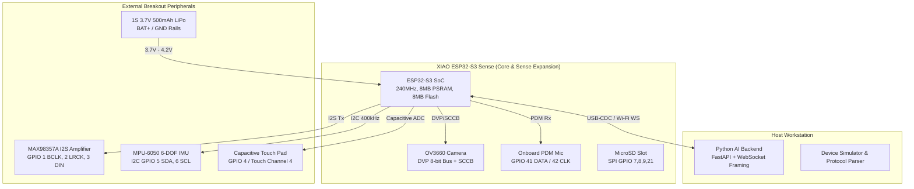

# NextSight AI Smart Glasses — Staged Hardware Bring-Up Guide

**Platform:** Seeed Studio XIAO ESP32-S3 Sense  
**Target Chip:** ESP32-S3 (Dual-Core Xtensa LX7 @ 240 MHz, 8MB Octal PSRAM, 8MB Flash)  
**Host Environment:** Windows / Python 3.14 / ESP-IDF v5.x  
**Repository:** [Dipankar2105/AI_Glasses](https://github.com/Dipankar2105/AI_Glasses)  
**Status:** Bring-Up Package Prepared (Host Software & Build Readiness Verified; Physical Stages Pending Hardware Arrival)

---

## 1. Hardware Architecture & Peripheral Overview



---

## 2. Authoritative Verification vs. Discrepancy Analysis

| Subsystem / Item | Assigned Hardware & Pins | Verification Level | Notes & Discrepancy Resolution |
| :--- | :--- | :--- | :--- |
| **SoC / Module** | Seeed Studio XIAO ESP32-S3 Sense | **Authoritative (Verified)** | ESP32-S3FN8 / R8 with 8MB Octal PSRAM. Verified against Seeed Studio factory schematics. |
| **Camera (OV3660)** | DVP Bus: D0-D7 (GPIO 15,17,18,16,14,12,11,48), XCLK (10), PCLK (13), VSYNC (38), HREF (47), SCCB (40,39) | **Authoritative (Verified)** | Factory B2B high-density connector. PSRAM allocation required for frame buffer. |
| **Microphone Interface** | **Onboard:** PDM Mode (CLK GPIO 42, DATA GPIO 41)<br/>**External (INMP441):** Standard I2S Mode | **Discrepancy Documented** | The XIAO Sense daughterboard uses an **onboard PDM MEMS microphone** (GPIO 41/42). If external INMP441 is used instead, standard I2S requires 3 external pins. Bring-up defaults to onboard PDM. |
| **Speaker / DAC (MAX98357A)** | D0 (GPIO 1 BCLK), D1 (GPIO 2 LRCK/WS), D2 (GPIO 3 DIN) | **Defined in Project Code** | Standard I2S Philips format (16kHz 16-bit Mono/Stereo). Verified pin multiplexing against breakout header. |
| **IMU (MPU-6050)** | D4 (GPIO 5 SDA), D5 (GPIO 6 SCL), Addr `0x68` | **Defined in Project Code** | Requires 3.3V supply and external 4.7kΩ pull-ups if not integrated on breakout module. |
| **Capacitive Touch** | D3 (GPIO 4 / Touch4) | **Defined in Project Code** | Internal ESP32-S3 touch peripheral with software debouncing. |
| **Power Supply** | 1S 3.7V 500mAh LiPo to BAT+/GND | **Provisional Design Assumption** | Onboard charge controller on XIAO. Low-battery cutoff modeled at 3.58V (15%), critical at 3.40V (5%). |
| **Thermal Thresholds** | Warm 45°C, Throttle 55°C, Shutdown 70°C | **Requires Physical Measurement** | Provisional thresholds based on smart glasses skin-contact comfort standard (ISO 13732-1). |

---

## 3. Staged Bring-Up Procedure

### Stage 0 — Preflight & Build Environment Check
* **Goal:** Verify host tools, firmware binaries, pinout assignments, and bench power supply before connecting any hardware.
* **Mandatory Physical Hardware:** No (Host check runnable immediately).
* **Prerequisites:**
  - Python 3.10+ with project virtual environment activated.
  - ESP-IDF v5.x toolchain installed (verified at `C:\Users\Routewise\esp-idf`).
  - Target firmware binary present (`xiaozhi.bin` or ESP-IDF build output).
* **Procedure / Commands:**
  ```powershell
  # 1. Run host validation suite
  python run_full_validation.py

  # 2. Check firmware build artifact
  powershell -ExecutionPolicy Bypass -File scripts/hardware_validation.ps1
  ```
* **Expected Output:**
  - All 219 host unit and regression tests pass.
  - Baseline firmware artifact `xiaozhi.bin` detected and verified for target `esp32s3`.
* **Pass/Fail Criteria:**
  - **PASS:** 0 test failures, firmware image size <= 3.0 MB, target matches ESP32-S3.
  - **FAIL:** Missing dependencies, binary missing, or regression test failure.
* **Status:** **VERIFIED (Host Environment Ready)**

---

### Stage 1 — Board Enumeration & Serial Boot Verification
* **Goal:** Confirm the XIAO ESP32-S3 Sense powers up cleanly over USB-C, enumerates COM port, and boots firmware without panic/bootloop.
* **Mandatory Physical Hardware:** Yes (XIAO ESP32-S3 Sense board).
* **Prerequisites:** USB-C data cable, dev PC with CP210x / CH34x / native USB CDC drivers.
* **Procedure / Diagnostic Actions:**
  1. Connect XIAO ESP32-S3 Sense via USB-C.
  2. Identify assigned COM port in Windows Device Manager (`Ports (COM & LPT)`).
  3. Open serial monitor at 115,200 baud:
     ```powershell
     python -m serial.tools.miniterm COM<X> 115200
     ```
  4. Press the hardware `RST` button and record the cold boot log.
* **Expected Output:**
  - Bootloader banner: `ESP-IDF v5.x`, chip `ESP32-S3`, Octal PSRAM initialized (`8MB`).
  - Application start: `NextSight / Xiaozhi firmware starting`.
  - No crash dumps, brownout resets, or WDT triggers.
* **Pass/Fail Criteria:**
  - **PASS:** Clean boot to idle state within < 1500 ms, PSRAM detected >= 8 MB.
  - **FAIL:** `Brownout detector was triggered`, `Guru Meditation Error`, or failure to enumerate over USB.
* **Status:** **NOT RUN — HARDWARE UNAVAILABLE**

---

### Stage 2 — MPU-6050 IMU & Capacitive Touch Validation
* **Goal:** Validate I2C bus communication with MPU-6050 at address `0x68`, verify physical unit conversions (accel g, gyro deg/s), and verify touch pad debouncing on GPIO 4.
* **Mandatory Physical Hardware:** Yes (XIAO board + MPU-6050 + touch pad).
* **Prerequisites:** Stage 1 passed; I2C wiring verified (SDA -> GPIO 5, SCL -> GPIO 6, 3.3V, GND).
* **Procedure / Diagnostic Actions:**
  1. Boot firmware with IMU driver enabled.
  2. Verify I2C WHO_AM_I register returns `0x68`.
  3. Perform stationary calibration on flat table:
     - Accelerometer Z approx +1.0g +/- 0.05g, X approx 0.0g, Y approx 0.0g.
     - Gyroscope angular rates < 0.5 deg/s at rest.
  4. Perform test gestures:
     - Head Nod (Pitch oscillation +/- 25 deg).
     - Head Shake (Yaw oscillation +/- 30 deg).
     - Head Tilt (Roll offset +/- 20 deg).
  5. Test capacitive touch: Single tap, double tap, long press (> 800 ms).
* **Expected Output:**
  - Valid IMU telemetry stream at 100 Hz.
  - Motion event dispatcher outputs: `GestureEvent(type=HEAD_NOD, confidence>=0.80)`.
  - Touch event dispatcher outputs: `TouchEvent(type=TAP, confidence=1.0)`.
* **Pass/Fail Criteria:**
  - **PASS:** IMU sample validity > 99%, zero false gestures while at rest, touch debounce < 50 ms.
  - **FAIL:** I2C timeout / NACK, floating readings, stuck touch state.
* **Status:** **NOT RUN — HARDWARE UNAVAILABLE**

---

### Stage 3 — OV3660 Camera Initialization & Frame Capture
* **Goal:** Initialize the OV3660 camera sensor via SCCB/DVP interface, capture real JPEG frames into PSRAM, and transmit frame to host backend.
* **Mandatory Physical Hardware:** Yes (XIAO ESP32-S3 Sense with daughterboard attached).
* **Prerequisites:** Stage 1 passed; daughterboard firmly seated on B2B connector.
* **Procedure / Diagnostic Actions:**
  1. Enable camera subsystem in firmware (`esp_camera_init()`).
  2. Request test frame capture at QVGA (320x240) and VGA (640x480).
  3. Verify frame buffer allocated in external PSRAM.
  4. Transmit frame over protocol framing (`CAMERA_FRAME`, packet type `0x04`).
  5. In host backend, verify frame receipt, decode JPEG buffer, and run image quality filter.
* **Expected Output:**
  - Serial log: `Camera init OK. Sensor PID: 0x3660`.
  - Frame capture time: < 120 ms for QVGA.
  - Host validation: Image quality score > 0.20 (brightness > 10, sharpness > 5.0).
* **Pass/Fail Criteria:**
  - **PASS:** Valid JPEG binary stream, correct dimensions, zero buffer corruption.
  - **FAIL:** `Camera probe failed`, green/pink artifact lines, PSRAM allocation failure.
* **Status:** **NOT RUN — HARDWARE UNAVAILABLE**

---

### Stage 4 — Microphone PCM Capture & DSP Audio Pipeline
* **Goal:** Capture live audio through the onboard PDM microphone (GPIO 41/42), stream 16kHz 16-bit Mono PCM, and validate DSP pipeline (DC Blocker -> VAD -> Noise Suppression -> AGC).
* **Mandatory Physical Hardware:** Yes (XIAO ESP32-S3 Sense).
* **Prerequisites:** Stage 1 passed; firmware built with audio HAL and DSP modules.
* **Procedure / Diagnostic Actions:**
  1. Initialize PDM microphone channel in ESP-IDF I2S driver (16,000 Hz).
  2. Capture 5 seconds of ambient silence and 5 seconds of spoken voice ("NextSight test one two three").
  3. Stream PCM frames (`AUDIO_PCM`, packet type `0x03`, 640 bytes per 20ms chunk).
  4. Verify DSP metrics:
     - Ambient noise floor < -45 dBFS.
     - Speech SNR improvement > 10 dB through Noise Suppression.
     - VAD trigger active during speech, inactive during silence.
* **Expected Output:**
  - Clean PCM audio without clipping or periodic clicking.
  - End-to-end DSP latency < 15 ms per 20ms frame.
* **Pass/Fail Criteria:**
  - **PASS:** Zero DMA underruns/overruns, VAD speech detection accuracy > 95%, no DC offset.
  - **FAIL:** Silent buffers (0x00), full-scale distortion/clipping, DMA buffer overflow.
* **Status:** **NOT RUN — HARDWARE UNAVAILABLE**

---

### Stage 5 — Speaker Playback & I2S Amplifier Validation
* **Goal:** Validate I2S audio output to MAX98357A amplifier and directional speaker (GPIO 1 BCLK, 2 LRCK, 3 DIN) without audio distortion or full-duplex interference.
* **Mandatory Physical Hardware:** Yes (XIAO board + MAX98357A + 8 Ohm speaker).
* **Prerequisites:** Stage 1 passed; MAX98357A wiring verified (GAIN connected to GND or 100k pull-down for 9dB gain).
* **Procedure / Diagnostic Actions:**
  1. Play 440 Hz test tone (sine wave) at -12 dBFS for 2 seconds.
  2. Play sample TTS synthesized voice prompt ("Hello, NextSight is ready").
  3. Verify full-duplex operation: Simultaneous microphone capture and speaker playback with AEC (Acoustic Echo Cancellation) reference loop enabled.
* **Expected Output:**
  - Clear, intelligible audio output with zero POP noise at startup/shutdown.
  - AEC echo return loss enhancement (ERLE) > 12 dB.
* **Pass/Fail Criteria:**
  - **PASS:** Stable I2S DMA playback, no audible pops/clicks, no amplifier thermal shutdown.
  - **FAIL:** Stuttering audio (DMA starvation), speaker buzzing, excessive current draw (> 300 mA).
* **Status:** **NOT RUN — HARDWARE UNAVAILABLE**

---

### Stage 6 — Device-to-Host Transport & Framing Acceptance
* **Goal:** Validate binary framed WebSocket/TCP transport between physical ESP32-S3 and host Python backend.
* **Mandatory Physical Hardware:** Yes (XIAO ESP32-S3 connected via Wi-Fi or USB-CDC).
* **Prerequisites:** Host backend running (`python tests/scripts/run_local_demo.py` or FastAPI server on port 8000).
* **Procedure / Diagnostic Actions:**
  1. Connect device to host WebSocket endpoint (`ws://<host-ip>:8000/api/v1/ws/device`).
  2. Send 100 consecutive telemetry packets (Heartbeat, Battery, Temperature).
  3. Send 50 image capture requests and verify bidirectional ACK/NACK handling.
  4. Simulate network disconnect: Unplug Wi-Fi router / toggle host interface; verify automatic device reconnect within < 3000 ms.
* **Expected Output:**
  - 12-byte header + CRC32 verification passes 100% of packets.
  - Bounded queue prevents device memory exhaustion during simulated packet drops.
* **Pass/Fail Criteria:**
  - **PASS:** Packet CRC error rate < 0.01%, reconnection recovery < 3.0 s, zero memory leaks.
  - **FAIL:** Malformed framing, unhandled socket exceptions, device crash on disconnect.
* **Status:** **NOT RUN — HARDWARE UNAVAILABLE**

---

### Stage 7 — Power & Thermal Safety Bench Measurements
* **Goal:** Measure real physical current draw across operating states and verify that software power-policy gates prevent overheating and brownouts.
* **Mandatory Physical Hardware:** Yes (XIAO board + bench power supply / Nordic Power Profiler / Current Meter + thermocouple).
* **Prerequisites:** Bench power supply set strictly to 3.70 V, current limit set to 500 mA.
* **Procedure / Diagnostic Actions:**
  1. Measure quiescent current in **IDLE / Light Sleep** state (Target: < 10 mA).
  2. Measure current during **Active Audio Streaming** (Target: < 60 mA).
  3. Measure current during **Camera Capture Burst** (Target: < 120 mA).
  4. Measure current during **Full-Duplex Vision + Audio + Speaker** (Target: < 250 mA).
  5. Feed simulated low-battery telemetry (3.55 V / 12%) and verify policy enters `LOW_POWER` state, blocking vision capture.
  6. Expose thermocouple to warm air (~56 deg C) and verify policy enters `HOT_THROTTLED` state, halving capture duty cycle.
* **Expected Output:**
  - Measured power matches modeled power budget within +/- 20%.
  - State machine correctly executes safety fallbacks: `LOW_POWER` -> `CRITICAL_SHUTDOWN`.
* **Pass/Fail Criteria:**
  - **PASS:** Max peak current < 450 mA, thermal rise < 15 deg C above ambient at idle, strict safety state enforcement.
  - **FAIL:** Current > 500 mA (brownout risk), temperature > 65 deg C during normal use, failure to gate high-power states.
* **Status:** **NOT RUN — HARDWARE UNAVAILABLE**

---

### Stage 8 — Integrated End-to-End Acceptance Test
* **Goal:** Execute full user interaction loop on physical glasses: Touch tap / Head gesture -> Camera capture -> Audio streaming -> Host AI reasoning -> Speaker audio response.
* **Mandatory Physical Hardware:** Yes (Fully assembled NextSight glasses).
* **Prerequisites:** Stages 1 through 7 completed successfully.
* **Procedure / Diagnostic Actions:**
  1. User performs double-tap on capacitive temple or head nod.
  2. Glasses capture scene photo with OV3660 and record voice query: "What am I looking at?"
  3. Telemetry packet + Image + Audio transmitted over binary WebSocket transport.
  4. Host AI backend processes query through MCP tool registry and vision pipeline.
  5. Response audio streamed back to glasses and played through MAX98357A directional speaker.
* **Expected Output:**
  - End-to-end latency < 1500 ms (local mock) or < 3500 ms (cloud LLM).
  - Clear, natural voice reply delivered to user.
* **Pass/Fail Criteria:**
  - **PASS:** Complete interaction cycle executes smoothly without dropped packets, buffer underruns, or state desynchronization.
  - **FAIL:** Any crash, dropped response, audio glitch, or unhandled protocol error.
* **Status:** **NOT RUN — HARDWARE UNAVAILABLE**

---

## 4. Hardware Bring-Up Summary Status Matrix

| Stage | Stage Description | Target Subsystem | Status | Blocker / Dependency |
| :---: | :--- | :--- | :---: | :--- |
| **0** | Preflight & Host Environment Check | Host PC / Toolchain | **PASSED** | None (Fully verified) |
| **1** | Board Enumeration & Serial Boot | ESP32-S3 SoC / USB | **NOT RUN** | Physical XIAO ESP32-S3 Sense board |
| **2** | MPU-6050 IMU & Touch Validation | I2C IMU / Touch ADC | **NOT RUN** | Physical MPU-6050 & touch pad |
| **3** | OV3660 Camera Capture & PSRAM | DVP Camera / PSRAM | **NOT RUN** | Physical OV3660 daughterboard |
| **4** | Microphone PCM Capture & DSP | PDM Mic / DSP | **NOT RUN** | Physical onboard PDM mic |
| **5** | Speaker Playback & I2S Amplifier | MAX98357A I2S DAC | **NOT RUN** | Physical MAX98357A & speaker |
| **6** | Device-to-Host Transport | WebSocket / Framing | **NOT RUN** | Physical device network connection |
| **7** | Power & Thermal Safety Bench | LiPo / Thermals | **NOT RUN** | Physical bench supply & meter |
| **8** | Integrated End-to-End Acceptance | Full Smart Glasses | **NOT RUN** | Fully assembled hardware unit |
